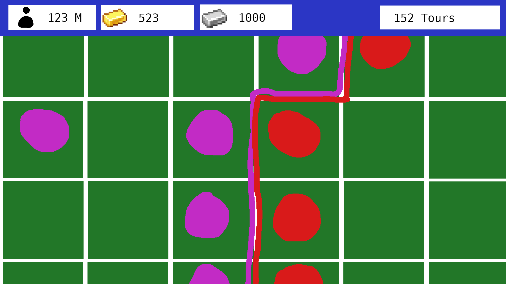
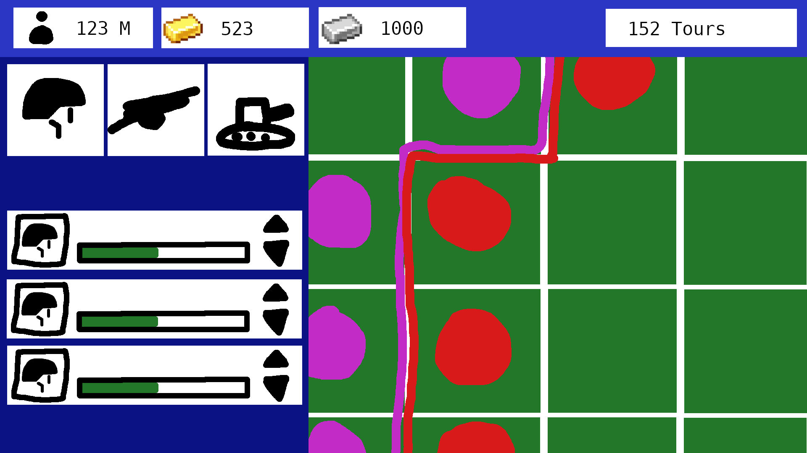
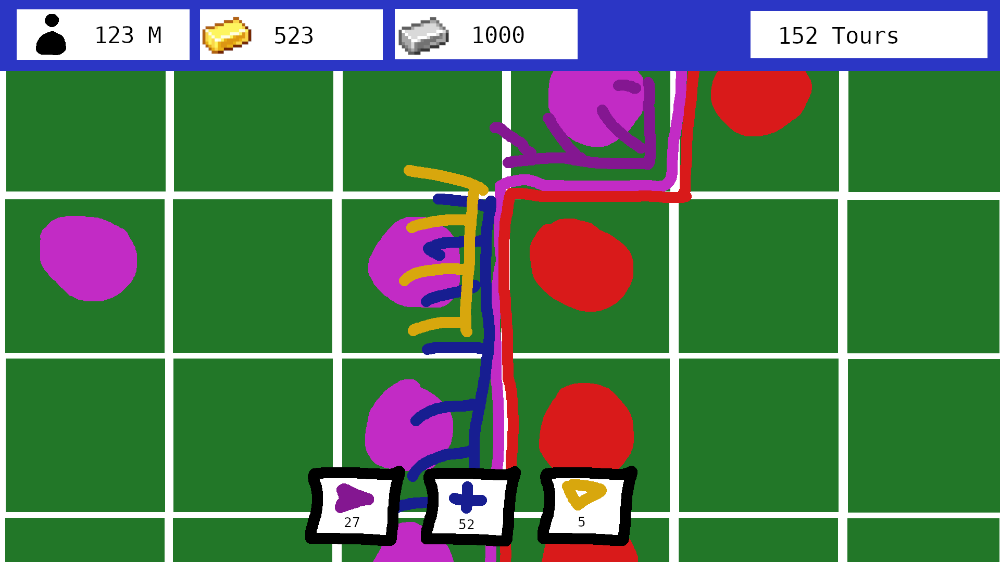
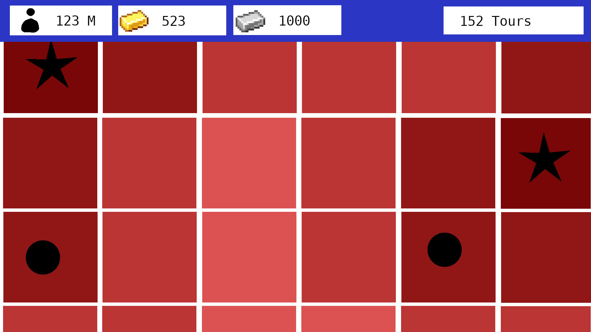
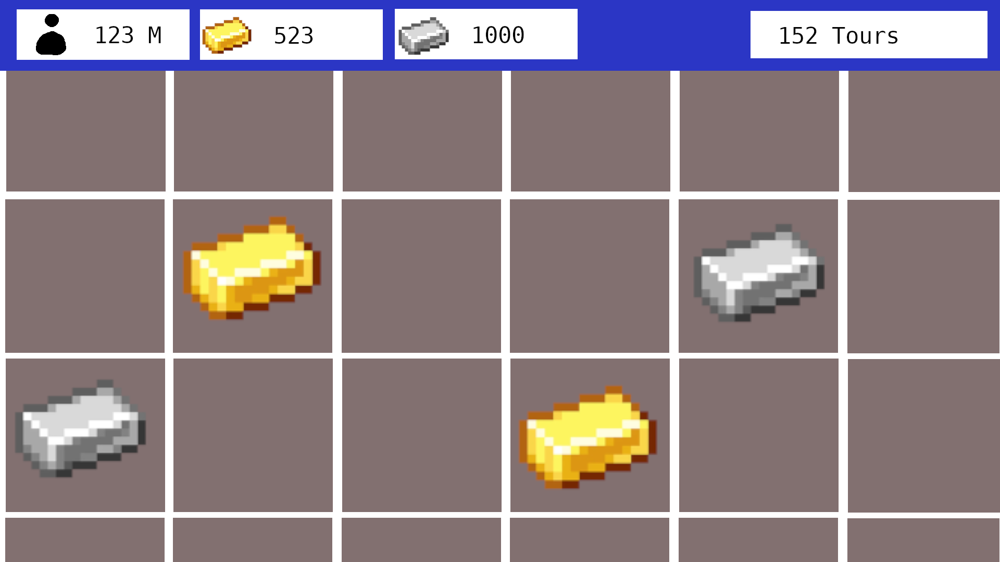

# Sillyzation

# Specifications

## Ideas
- Jeu de stratégie tour par tour
- rapide
- free for all toujours en guerre
- focus sur la guerre
- la production d'unité se fait par rapport à la population et les ressources.
- la carte est grille
- minimiser les menus
- combat inspiré par HOI4 mais tour par tour
- tu perd quant tu n'a plus de ville
- tour court
- Tours avec timer ou tour après que tous le monde dit "next"

## Basic Overview

### Default War Map Mode

### Population Map Mode

### Ressource Map Mode

## TODO
- Charger la carte
	- Definir la population et ressource (le terrain ?)
	- Pouvoir lire ces données
- Carte :
	- Pouvoir dessiner la carte avec le terrain
	- Placer le nom du pays/joueur sur la carte ?
	- Zone de contrôle :
		- Pouvoir mettre en évidence quelle pays à quel case
		- Détecter les fronts pour pouvoir placer des unités dessus
- Unitées :
	- Placer une unité sur la carte
	- Pouvoir la déplacer
	- Pouvoir les assigner à un front
	- Pouvoir faire un combat avec un autre unité en face
	- Définir les statistiques de chaques types d'unités
- Menu :
	- Topbar :
		- Afficher la population calculée avec les cases controllées
		- Afficher les ressources obtenu avec les cases controllées
		- Afficher le tour actuel (Date ?)
		- Afficher le drapeau et le nom du pays ?
		- Afficher le nombre d'unité actuelle / max (75/80)
		- Avoir un bouton pour ouvrir le menu contruction d'unités
	- Menu construction unité :
		- Avoir des boutons pour contruires des nouvelles unités
		- Avoir un queue des unités en cours de contructions
- Serveur
	- Définir un client et un serveur :
		- Un Client ne peut voir que ce que un joueur peut voir et ne pas donner
		plus d'info (Anticheat)
		- Un Serveur doit gèrer tout les Clients.

# Rules Git
Ne pas travailler dans le main !!!

à choisir
- Toujours faire une branche pour une feature
- Une branche par personne mais il faut faire des versions stables une fois
de temps en temps.